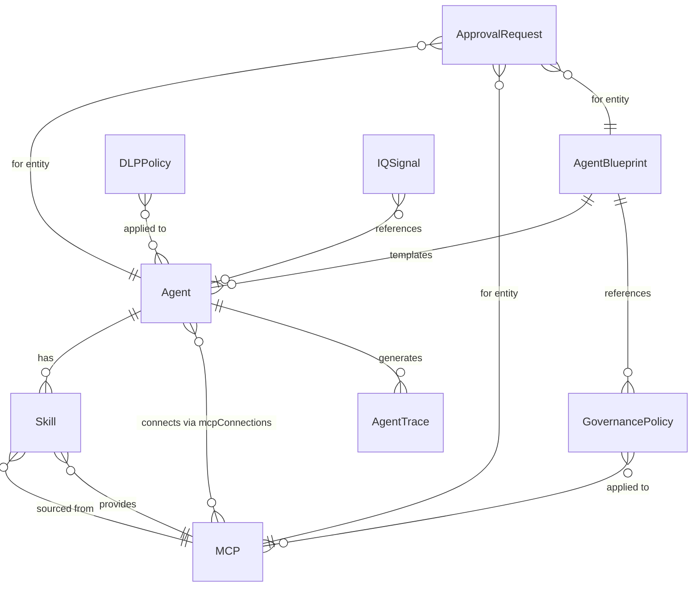

# ✨ feat: Unified Agent Platform — MCP + Agents + Skills + Work IQ

## Enhancement Summary

**Deepened on:** 2026-03-31
**Research agents used:** best-practices-researcher, security-sentinel, architecture-strategist, performance-oracle

### Key Improvements from Deepening
1. **Data layer split** — `lib/data.ts` → `lib/data/` directory with domain-specific modules for tree-shaking
2. **Entra identity model enriched** — Added structured `entraIdentity` object with scoped permissions and consent status
3. **Work IQ governed access** — At least 1 Work IQ MCP starts as `pending` to demonstrate admin consent flow
4. **Phase 3 split** — Broken into 3a (Marketplace + Agent Registry) and 3b (Agent Detail + Creation Wizard)
5. **Shared component extraction** — `LifecycleStatusBadge`, `StatsGrid`, `BlueprintChip` prevent cross-page duplication
6. **Governance tab extraction** — Sub-components prevent 500+ line page files
7. **Canvas performance** — Memoized connection rendering and `requestAnimationFrame` for drag operations
8. **Mock ID conventions** — `mock-entra-*` prefix prevents confusion with real Entra object IDs
9. **BasePolicy interface** — Shared base between `GovernancePolicy` and `DLPPolicy`
10. **MCP status fix** — Resolve existing `'active'` vs `'approved'` type mismatch before expansion

### Security Findings Applied
- Entra identity model extended with `appId`, `tenantId`, scoped permissions, consent status
- Work IQ MCPs demonstrate governed access (not all pre-approved)
- Mock data uses obviously-fake IDs (`mock-entra-*`, `contoso.onmicrosoft.com`)
- Approval workflow notes separation of duties constraint
- Audit traces include `initiatedBy` actor attribution

---

## Overview

Transform the Nexus MCP Marketplace into a comprehensive **Unified Agent Platform** with 6 navigation pillars: Marketplace, Agents, Skills, Orchestration, Governance, and Intelligence. Integrates Microsoft Agent 365 blueprint model, Work IQ MCP servers, DLP governance, and OpenTelemetry observability — all with mock data for interactive demo.

This plan carries forward all key decisions from the brainstorm (see brainstorm: [docs/brainstorms/2026-03-31-unified-agent-platform-brainstorm.md](docs/brainstorms/2026-03-31-unified-agent-platform-brainstorm.md)).

## Problem Statement / Motivation

The current platform manages MCPs in isolation. Enterprise customers need a unified lifecycle management story across MCPs, Agents, Skills, and Intelligence — governed through Microsoft Agent 365 policies and enriched by the Microsoft IQ platform. The platform must serve three personas: IT Admins, Developers, and Business Users.

## Proposed Solution

Implement in 5 phases, each building on the previous. All data is mocked — no real API integration required. Each phase produces a deployable, demo-able state.

---

## Technical Approach

### Architecture

```
lib/types.ts          ← All new interfaces (extend existing)
lib/data/             ← Mock data split by domain (tree-shakeable)
  index.ts            ← Barrel re-export (backward compat)
  mcp-servers.ts      ← mcpServers, mcpCategories
  agents.ts           ← agentData
  blueprints.ts       ← agentBlueprints
  governance.ts       ← governancePolicies, dlpPolicies, approvalRequests
  intelligence.ts     ← iqSignals, agentTraces
components/app-shell  ← 6-pillar navigation redesign
components/shared/    ← Extracted reusable atoms
  lifecycle-status-badge.tsx
  stats-grid.tsx
  blueprint-chip.tsx
app/                  ← Page-level changes per pillar
app/governance/       ← Tab sub-components co-located here
  policies-tab.tsx
  blueprints-tab.tsx
  approvals-tab.tsx
  audit-tab.tsx
  compliance-tab.tsx
components/           ← Shared components (cards, modals, wizards)
```

**Data flow**: Static imports from `lib/data/` → page components → UI. No API layer. All state is local `useState`. Barrel re-export from `lib/data/index.ts` preserves existing `@/lib/data` import paths.

**Pattern consistency**: Follow existing patterns from codebase research:
- `"use client"` directive on all interactive pages
- `useState` for local state (search, filters, tabs)
- `cn()` utility for conditional Tailwind classes
- shadcn/ui components from `@/components/ui/`
- Lucide icons with individual imports
- Status/category color maps as const objects
- 4-column stat grids at page top (6-column only for data-dense pages)
- Tabbed interfaces for multi-section views
- `useSelectedLayoutSegment()` for nav active state (more resilient than `usePathname()`)
- `aria-current="page"` on active nav links (WCAG 2.1)

### Implementation Phases

---

#### Phase 1: Data Foundation — Types & Mock Data

**Goal**: Define all new interfaces and create comprehensive mock data.

**Estimated scope**: 2 files modified (`lib/types.ts`, `lib/data.ts`)

##### 1.1 Type Definitions (`lib/types.ts`)

Extend existing types. Keep backward compatibility — no changes to existing interfaces except fixing `MCP.status` type mismatch (existing data uses `'active'` but type says `'approved'` — normalize to `'approved'`).

```typescript
// --- Fix existing MCP.status mismatch ---
// Change 'approved' to 'active' in the status union to match data:
status: 'active' | 'pending' | 'rejected'

// --- Base Policy (shared between GovernancePolicy and DLPPolicy) ---
interface BasePolicy {
  id: string
  name: string
  description: string
  appliedTo: string[]
  status: 'active' | 'draft' | 'deprecated'
  createdBy: string
  createdAt: string
}

// --- Agent 365 Blueprint ---
interface AgentBlueprint {
  id: string
  name: string
  description: string
  capabilities: string[]
  requiredMCPServers: string[]        // MCP IDs
  securityConstraints: string[]       // Human-readable rules
  complianceRequirements: string[]
  governancePolicies: string[]        // Policy IDs
  status: 'draft' | 'review' | 'approved' | 'active' | 'suspended' | 'retired'
  createdBy: string
  createdAt: string
  approvedBy?: string
  approvedAt?: string
}

// --- Extended Agent (backward compatible) ---
// Add optional fields to existing Agent interface:
//   blueprintId?: string
//   entraIdentity?: EntraIdentity
//   lifecycleStatus?: 'draft' | 'review' | 'approved' | 'active' | 'suspended' | 'retired'
//   notificationChannels?: string[]
//   observabilityEnabled?: boolean

// --- Entra Identity (structured, not flat string) ---
interface EntraIdentity {
  objectId: string            // Use 'mock-entra-*' prefix format
  appId: string               // Application (client) ID
  tenantId: string            // Use 'mock-tenant-contoso-demo'
  mailbox: string             // agent-name@contoso.onmicrosoft.com
  permissions: EntraPermission[]
}

interface EntraPermission {
  mcpId: string
  scopes: string[]            // e.g. ['Mail.Read', 'Calendars.ReadWrite']
  consentType: 'admin' | 'user'
  consentStatus: 'granted' | 'pending' | 'denied'
}

// --- Work IQ (extends MCP shape — use existing MCP interface with flags) ---
// Add to MCP interface:
//   isWorkIQ?: boolean
//   workIQService?: 'mail' | 'calendar' | 'teams' | 'sharepoint'
//   adminConsentRequired?: boolean

// --- Intelligence ---
interface IQSignal {
  id: string
  source: 'work-iq' | 'foundry-iq' | 'fabric-iq'
  layer: 'data' | 'memory' | 'inference'
  type: string
  content: string
  agentId?: string
  timestamp: string
  confidence: number
}

// --- DLP Policy (extends BasePolicy) ---
interface DLPPolicy extends BasePolicy {
  level: 'tenant' | 'environment' | 'agent'
  rules: DLPRule[]
  enforcement: 'block' | 'warn' | 'audit'
}

interface DLPRule {
  id: string
  type: 'connector-restriction' | 'data-boundary' | 'channel-block' | 'sensitivity-label'
  condition: string
  action: string
  dataClassifications?: Array<'public' | 'internal' | 'confidential' | 'restricted'>
}

// --- Observability ---
interface AgentTrace {
  id: string
  agentId: string
  agentName: string
  traceType: 'invocation' | 'tool_execution' | 'inference' | 'notification'
  toolServerName?: string
  parameters?: Record<string, unknown>
  result: 'success' | 'failure' | 'timeout'
  durationMs: number
  timestamp: string
  initiatedBy?: string        // Actor attribution for audit
}

// --- Approval Workflow ---
interface ApprovalRequest {
  id: string
  type: 'agent-registration' | 'mcp-access' | 'blueprint-activation' | 'policy-change'
  title: string
  description: string
  requestorId: string
  requestorName: string
  approverId?: string
  approverName?: string
  stage: 'pending' | 'in-review' | 'approved' | 'rejected'
  entityId: string                    // Agent/MCP/Blueprint ID
  entityType: 'agent' | 'mcp' | 'blueprint' | 'policy'
  submittedAt: string
  reviewedAt?: string
  comments?: string
}
// NOTE: Enforce separation of duties — requestorId !== approverId in mock data

// --- Make GovernancePolicy extend BasePolicy ---
// Refactor existing GovernancePolicy to extend BasePolicy

// --- Extended MCPCategory ---
// Add to MCPCategory union: 'Productivity'
```

- [ ] Fix `MCP.status` type to use `'active'` (match existing data) instead of `'approved'`
- [ ] Add `BasePolicy` interface and refactor `GovernancePolicy` to extend it
- [ ] Add `AgentBlueprint` interface
- [ ] Add `EntraIdentity` and `EntraPermission` interfaces
- [ ] Extend `Agent` interface with optional `blueprintId`, `entraIdentity`, `lifecycleStatus`, `notificationChannels`, `observabilityEnabled`
- [ ] Extend `MCP` interface with optional `isWorkIQ`, `workIQService`, `adminConsentRequired`
- [ ] Add `'Productivity'` to `MCPCategory` union
- [ ] Add `IQSignal` interface
- [ ] Add `DLPPolicy` extending `BasePolicy` and `DLPRule` interfaces
- [ ] Add `AgentTrace` interface with `initiatedBy` field
- [ ] Add `ApprovalRequest` interface

##### 1.2 Data Layer Split & Mock Data

**First: Split `lib/data.ts` into `lib/data/` directory** (architecture recommendation):

```
lib/data/index.ts           ← re-exports all (preserves @/lib/data import paths)
lib/data/mcp-servers.ts     ← mcpServers, mcpCategories (existing + Work IQ)
lib/data/agents.ts          ← agentData (existing + new agents)
lib/data/blueprints.ts      ← agentBlueprints (new)
lib/data/governance.ts      ← governancePolicies + dlpPolicies + approvalRequests
lib/data/intelligence.ts    ← iqSignals + agentTraces
```

This enables per-route tree-shaking — pages importing only agents won't bundle traces/signals.

**Mock ID Convention**: All mock IDs for Entra/Azure entities use obviously-fake prefixes:
- Entra Object IDs: `mock-entra-00000001-0000-0000-0000-000000000001`
- Tenant IDs: `mock-tenant-contoso-demo`
- Agent mailboxes: `agent-name@contoso.onmicrosoft.com`
- **Never** use real GUID format that could be confused with production credentials.

All mock data additions below. Entity IDs must be consistent across cross-references.

**Work IQ MCP Servers** (4 new entries in `mcpServers`):

| ID | Name | Service | Category |
|----|------|---------|----------|
| `workiq-mail-mcp` | Work IQ Mail | mail | Productivity |
| `workiq-calendar-mcp` | Work IQ Calendar | calendar | Productivity |
| `workiq-teams-mcp` | Work IQ Teams | teams | Productivity |
| `workiq-sharepoint-mcp` | Work IQ SharePoint | sharepoint | Productivity |

All Work IQ MCPs: `isWorkIQ: true`, `complianceLevel: 'high'`, `provider: 'Microsoft'`, `adminConsentRequired: true`. Three are `status: 'active'`, `isInstalled: true`. **Work IQ Teams** is `status: 'pending'`, `isInstalled: false` to demonstrate the governed admin consent flow.

**Agent Blueprints** (4 entries in `agentBlueprints`):

| ID | Name | Status | Required MCPs |
|----|------|--------|---------------|
| `bp-cloud-ops` | Cloud Operations Blueprint | active | axiom-mcp, neon-mcp |
| `bp-compliance` | Compliance & Risk Blueprint | active | betterstack-mcp, mongodb-mcp |
| `bp-knowledge-worker` | Knowledge Worker Blueprint | active | workiq-mail-mcp, workiq-calendar-mcp, workiq-teams-mcp |
| `bp-hr-onboarding` | HR Onboarding Blueprint | review | workiq-mail-mcp, workiq-sharepoint-mcp, supabase-mcp |

**New Agents** (3 new entries in `agentData`, all with Agent 365 fields):

| ID | Name | Blueprint | Status | Lifecycle |
|----|------|-----------|--------|-----------|
| `compliance-sentinel` | Compliance Sentinel | bp-compliance | active | active |
| `knowledge-worker-agent` | Knowledge Worker Agent | bp-knowledge-worker | active | active |
| `hr-onboarding-agent` | HR Onboarding Agent | bp-hr-onboarding | training | review |

Existing 5 agents get `blueprintId` and `lifecycleStatus` (all `active`), `observabilityEnabled: true`.

**New Skills** (5 new, added to the new agents):

| Name | MCP Source | Agent |
|------|-----------|-------|
| Email Summarization | workiq-mail-mcp | knowledge-worker-agent |
| Meeting Prep | workiq-calendar-mcp | knowledge-worker-agent |
| Document Insights | workiq-sharepoint-mcp | knowledge-worker-agent |
| Onboarding Workflow | workiq-mail-mcp | hr-onboarding-agent |
| Compliance Scanning | betterstack-mcp | compliance-sentinel |

**DLP Policies** (3 entries in `dlpPolicies`):

| ID | Name | Level | Enforcement |
|----|------|-------|-------------|
| `dlp-1` | External Connector Restriction | tenant | block |
| `dlp-2` | Confidential Data Boundary | environment | warn |
| `dlp-3` | Channel Publishing Control | agent | audit |

**Agent Traces** (10+ entries in `agentTraces`):
Mix of `invocation`, `tool_execution`, `inference`, `notification` types across multiple agents. Include successful and failed traces with realistic durations (50ms–2500ms).

**Approval Requests** (5 entries in `approvalRequests`):

| Type | Title | Stage |
|------|-------|-------|
| agent-registration | HR Onboarding Agent | in-review |
| mcp-access | Work IQ Teams for DevOps | pending |
| blueprint-activation | HR Onboarding Blueprint | pending |
| policy-change | Update rate-limit thresholds | approved |
| agent-registration | Data Analytics Agent v2 | rejected |

**IQ Signals** (12+ entries in `iqSignals`):
Mix across work-iq/foundry-iq/fabric-iq sources and data/memory/inference layers. Realistic content like "Detected 3 conflicting meeting schedules for Engineering team" or "Model inference latency spike on Compliance Agent: 2300ms avg".

- [ ] Add `'Productivity'` to `mcpCategories` array
- [ ] Split `lib/data.ts` into `lib/data/` directory with barrel re-export
- [ ] Add 4 Work IQ MCP server entries (3 active, 1 pending for consent flow)
- [ ] Add `agentBlueprints` export array (4 entries)
- [ ] Add 3 new agent entries with Agent 365 fields and `EntraIdentity` objects
- [ ] Update existing 5 agents with `blueprintId`, `lifecycleStatus`, `observabilityEnabled`
- [ ] Add 5 new skills to the new agents
- [ ] Add `dlpPolicies` export array (3 entries)
- [ ] Add `agentTraces` export array (10+ entries, include `initiatedBy` field)
- [ ] Add `approvalRequests` export array (5 entries, enforce `requestorId !== approverId`)
- [ ] Add `iqSignals` export array (12+ entries)
- [ ] Verify all cross-entity ID references are consistent
- [ ] Verify all mock Entra IDs use `mock-entra-*` prefix convention

##### Phase 1 Quality Gate

- [ ] TypeScript strict compilation passes (`pnpm build`)
- [ ] All existing pages still render without errors (no import path breaks from data split)
- [ ] No breaking changes to existing interfaces
- [ ] `@/lib/data` import path still works via barrel re-export

---

#### Phase 2: Navigation & Shell Redesign

**Goal**: Redesign the app-shell navigation from 4-phase to 6-pillar layout. Create Intelligence page route.

**Estimated scope**: 2 files modified (`components/app-shell.tsx`, `app/layout.tsx`), 1 file created (`app/intelligence/page.tsx`)

##### 2.1 App Shell Navigation (`components/app-shell.tsx`)

Replace the current `navGroups` with 6 pillars. **Use `useSelectedLayoutSegment()`** instead of `usePathname()` for active state detection — more resilient to nested routes (e.g., `/agents/123` still highlights "Agents").

```typescript
const navGroups = [
  {
    id: 'marketplace',
    label: 'Marketplace',
    icon: Store,
    segment: null,             // Root route "/"
    items: [{ href: '/', label: 'MCP Catalog' }]
  },
  {
    id: 'agents',
    label: 'Agents',
    icon: Bot,
    segment: 'agents',
    items: [{ href: '/agents', label: 'Agent Registry' }]
  },
  {
    id: 'skills',
    label: 'Skills',
    icon: Sparkles,
    segment: 'skills',
    items: [{ href: '/skills', label: 'Skill Library' }]
  },
  {
    id: 'orchestration',
    label: 'Orchestration',
    icon: Workflow,
    segment: 'canvas',
    items: [{ href: '/canvas', label: 'Connection Canvas' }]
  },
  {
    id: 'governance',
    label: 'Governance',
    icon: Shield,
    segment: 'governance',
    items: [{ href: '/governance', label: 'Policies & Compliance' }]
  },
  {
    id: 'intelligence',
    label: 'Intelligence',
    icon: Brain,
    segment: 'intelligence',
    items: [
      { href: '/intelligence', label: 'Work IQ Dashboard' },
      { href: '/analytics', label: 'Analytics' }
    ]
  }
]
```

**Accessibility**: Add `aria-current="page"` on active nav links (WCAG 2.1 requirement).

Note: Since most pillars have a single nav item, consider rendering them as flat links rather than collapsible groups — the group/item hierarchy adds depth without benefit when there's only one child.

Update the activity feed mock items to include Agent 365-relevant activities (blueprint approvals, agent lifecycle changes, Work IQ activations).

##### 2.2 Intelligence Page Stub (`app/intelligence/page.tsx`)

Create a minimal placeholder page that renders within AppShell. This gets fleshed out in Phase 5.

```typescript
// app/intelligence/page.tsx
"use client"
import { AppShell } from "@/components/app-shell"
import { Brain } from "lucide-react"

export default function IntelligencePage() {
  return (
    <AppShell>
      <div className="p-6">
        <h1 className="text-2xl font-semibold flex items-center gap-2">
          <Brain className="h-6 w-6 text-accent" />
          Intelligence
        </h1>
        <p className="text-muted-foreground mt-2">Work IQ dashboard coming soon.</p>
      </div>
    </AppShell>
  )
}
```

- [ ] Redesign `navGroups` in `app-shell.tsx` to 6 pillars
- [ ] Update navigation icons (import `Store`, `Bot`, `Sparkles`, `Workflow`, `Brain`)
- [ ] Update activity feed items with Agent 365-relevant activities
- [ ] Create `app/intelligence/page.tsx` stub
- [ ] Verify all navigation links resolve correctly
- [ ] `pnpm build` passes — no broken routes

##### Phase 2 Quality Gate

- [ ] All 6 navigation groups render and highlight correctly
- [ ] All existing pages accessible via new nav structure
- [ ] `/intelligence` route renders stub page

---

#### Phase 3a: Marketplace & Agent Registry

**Goal**: Add Work IQ featured section to Marketplace. Redesign Agents list with blueprint lifecycle.

**Estimated scope**: 2 files modified (`app/page.tsx`, `app/agents/page.tsx`), 1 shared component created

##### 3a.1 Marketplace — Work IQ Featured Section (`app/page.tsx`)

Add a "Work IQ" featured section between the onboarding wizard and trending section:

- Filter `mcpServers` for `isWorkIQ === true`
- Render 4 Work IQ cards in a dedicated section with Microsoft branding (gradient purple-blue header)
- Each card shows: service icon (Mail/Calendar/Teams/SharePoint), name, capabilities, "Activated" badge
- Label: "Work IQ MCP Servers — Powered by Microsoft Agent 365"
- Add `'Productivity'` to the category sidebar

Existing marketplace behavior (search, filtering, trending, onboarding wizard) remains unchanged.

- [ ] Add Work IQ featured section with Microsoft branding
- [ ] Add Productivity category to sidebar
- [ ] Work IQ cards display service-specific icons (Mail, Calendar, Users, FileText)
- [ ] Existing search/filter/trending behavior preserved

##### 3a.2 Agent Registry Redesign (`app/agents/page.tsx`)

Redesign the agent list page with Agent 365 concepts:

**Stats Grid** (6 columns → breaking from 4-column pattern for richer data):
- Total Agents | Active | In Review | Blueprints | Total Requests | Avg Success Rate

**Agent Cards** — add to each card:
- Blueprint badge (small chip showing blueprint name, links to governance)
- Lifecycle status chip with extended colors:
  ```typescript
  const lifecycleColors = {
    draft: 'bg-slate-500/20 text-slate-400',
    review: 'bg-amber-500/20 text-amber-400',
    approved: 'bg-blue-500/20 text-blue-400',
    active: 'bg-emerald-500/20 text-emerald-400',
    suspended: 'bg-red-500/20 text-red-400',
    retired: 'bg-gray-500/20 text-gray-400',
  }
  ```
- Entra identity indicator (small shield icon if `entraObjectId` exists)
- Observability indicator (eye icon if `observabilityEnabled`)

**Filters** — extend:
- Status filter adds: draft, review, approved, suspended, retired
- Blueprint filter dropdown (filter agents by blueprint)
- Department filter (existing)

**"Create Agent" button** → opens multi-step wizard (see 3.4 below).

- [ ] Expand stats grid with blueprint count and lifecycle breakdown
- [ ] Add blueprint badge to agent cards
- [ ] Add lifecycle status chip with extended colors
- [ ] Add Entra identity and observability indicators to cards
- [ ] Extend filter options (lifecycle status, blueprint, department)

##### 3a.3 Shared Component Extraction

Extract reusable atoms used across 3+ pages to prevent duplication:

**`components/shared/lifecycle-status-badge.tsx`**: Renders lifecycle status chip with correct colors. Used in Agent Registry, Agent Detail, Governance Blueprints.

**`components/shared/stats-grid.tsx`**: Renders n-column stat grid. Supports 4-column (Marketplace, Skills) and 6-column (Agents, Governance) variants.

**`components/shared/blueprint-chip.tsx`**: Small badge showing blueprint name with link. Used in Agent cards and detail views.

- [ ] Create `components/shared/lifecycle-status-badge.tsx`
- [ ] Create `components/shared/stats-grid.tsx` with column-variant prop
- [ ] Create `components/shared/blueprint-chip.tsx`

##### Phase 3a Quality Gate

- [ ] Work IQ section renders in Marketplace with 4 server cards (3 active, 1 pending)
- [ ] Agent Registry shows blueprint badges and lifecycle status for all 8 agents
- [ ] Shared components render consistently across pages
- [ ] `pnpm build` passes

---

#### Phase 3b: Agent Detail & Creation Wizard

**Goal**: Extend Agent Detail with Blueprint/Identity/Observability tabs. Create Agent Creation Wizard.

**Estimated scope**: 2 files modified (`app/agents/[id]/agent-detail-client.tsx`, `components/agent-detail-content.tsx`), 1 new component

##### 3b.1 Agent Detail Enhancements (`components/agent-detail-content.tsx`)

Add 3 new tabs alongside existing Skills/Integrations/Activity:

**Blueprint Tab**:
- Shows inherited blueprint details (name, description, capabilities)
- Required MCPs list with install status
- Security constraints as badge list
- Compliance requirements
- Link to blueprint management in Governance

**Identity Tab**:
- Entra Object ID (readonly text field — shows `mock-entra-*` format)
- Application (Client) ID (readonly)
- Tenant ID (readonly — `mock-tenant-contoso-demo`)
- Agent Mailbox (readonly — `agent@contoso.onmicrosoft.com`)
- Granted Permissions list (scoped per MCP, showing Graph API scopes like `Mail.Read`)
- Permission consent status badges (granted/pending/denied)
- Notification Channels (Teams, Outlook, Word — toggleable)

**Observability Tab**:
- Filter `agentTraces` for this agent
- Timeline view of traces (sorted by timestamp descending)
- Each trace row: type icon, tool server name, result badge (success/failure), duration, timestamp
- Color coding: success = emerald, failure = red, timeout = amber
- Basic stats at top: total traces, success rate, avg duration

- [ ] Add Blueprint tab with policy/constraint display
- [ ] Add Identity tab with Entra fields and permissions
- [ ] Add Observability tab with trace timeline
- [ ] Use `<LifecycleStatusBadge>` shared component
- [ ] Existing Skills/Integrations/Activity tabs unchanged
- [ ] Default tab remains "skills"

##### 3b.2 Agent Creation Wizard (new component)

Create `components/agent-creation-wizard.tsx` — a Dialog-based multi-step wizard:

**Step 1 — Define Agent**: Name, description, department, icon selection
**Step 2 — Select Blueprint**: Grid of available blueprints (filtered by `status: 'active'`). Shows required MCPs per blueprint. Can proceed without blueprint (unmanaged agent).
**Step 3 — Assign MCPs**: Shows required MCPs from blueprint (auto-selected, disabled toggle) + optional additional MCPs from marketplace.
**Step 4 — Configure Identity**: Mock Entra identity fields (auto-generated `mock-entra-*` object ID, `@contoso.onmicrosoft.com` mailbox). Notification channel toggles. Shows scoped permissions preview based on selected MCPs.
**Step 5 — Review & Submit**: Summary of all selections. "Submit for Review" button sets lifecycle to `review`.

Since this is mock, the wizard doesn't persist — it shows a success toast on submit. Form inputs have length limits (name: 100 chars, description: 500 chars) for UX safety.

- [ ] Create `components/agent-creation-wizard.tsx` with 5 steps
- [ ] Step indicators (progress bar/dots) showing current step
- [ ] Back/Next navigation between steps
- [ ] Blueprint selection shows required MCPs
- [ ] Identity step shows `mock-entra-*` formatted IDs and permission scopes
- [ ] Input length limits on name and description fields
- [ ] Review step shows full summary
- [ ] Submit triggers success toast (mock)
- [ ] Wire into Agent Registry "Create Agent" button

##### Phase 3b Quality Gate

- [ ] Agent Detail shows Blueprint, Identity, Observability tabs with data
- [ ] Identity tab shows structured Entra identity with permissions
- [ ] Agent Creation Wizard completes all 5 steps without errors
- [ ] `pnpm build` passes

---

#### Phase 4: Governance & Skills Enhancements

**Goal**: Expand Governance with DLP, blueprints, audit, compliance tabs. Enhance Skills with versioning.

**Estimated scope**: 2 files modified (`app/governance/page.tsx`, `app/skills/page.tsx`), 5 tab sub-components created

##### 4.1 Governance Dashboard Redesign (`app/governance/page.tsx`)

Redesign with 5 tabs. **Extract each tab into a co-located sub-component** to keep the main page file under 200 lines (architecture recommendation — prevents 500+ line monolith).

```
app/governance/
  page.tsx              ← Shell with tabs and stats grid (~100 lines)
  policies-tab.tsx      ← Existing policies + DLP policies
  blueprints-tab.tsx    ← Agent blueprint management
  approvals-tab.tsx     ← Kanban-style approval workflow
  audit-tab.tsx         ← Defender-style trace table
  compliance-tab.tsx    ← Per-agent compliance scorecards
```

**Stats Grid** (6 columns):
- Total Policies | Active DLP Policies | Blueprints | Pending Approvals | Compliance Score | Audit Events

**Tab: Policies** (existing, extended):
- Show existing `governancePolicies` as before
- Add DLP policies section below (from `dlpPolicies` data)
- DLP cards show: level badge (tenant/environment/agent), enforcement mode, rule count
- Rule type colors extended:
  ```typescript
  const dlpRuleColors = {
    'connector-restriction': 'bg-rose-500/20 text-rose-400',
    'data-boundary': 'bg-cyan-500/20 text-cyan-400',
    'channel-block': 'bg-amber-500/20 text-amber-400',
    'sensitivity-label': 'bg-violet-500/20 text-violet-400',
  }
  ```

**Tab: Blueprints** (new):
- Grid of `agentBlueprints` as cards
- Each card: name, description, status badge, required MCPs count, agents using this blueprint count
- Status colors match lifecycle colors
- "Create Blueprint" button (opens dialog, mock only)

**Tab: Approvals** (extended):
- List `approvalRequests` grouped by stage columns (Kanban-style): Pending → In Review → Approved / Rejected
- Each card: request title, type badge, requestor, submitted date
- Click opens detail panel with description, entity link, action buttons (Approve/Reject — triggers state change in local state)
- "Rejected" items shown in separate column with reviewer comments

**Tab: Audit** (new — Defender-style, `audit-tab.tsx`):
- Table view of `agentTraces` (all agents)
- Columns: Timestamp, Agent, Trace Type, Tool Server, Result, Duration, Initiated By
- Sortable columns (click header to sort)
- Search/filter bar (filter by agent, type, result)
- Visual styling: monospace font for timestamps, dark table with alternating rows
- Title: "Advanced Hunting — Agent Tool Traces"
- **No KQL** — basic table with column sorting and search filter

**Tab: Compliance** (new):
- Compliance scorecard grid: one card per agent
- Each card: agent name, blueprint name, compliance score (percentage), compliance badge (high/medium/low)
- Score calculated from: blueprint adherence, policy violations, observability coverage
- Color: high (≥90%) = emerald, medium (70-89%) = amber, low (<70%) = red

- [ ] Add stats grid with 6 metrics
- [ ] Create `app/governance/policies-tab.tsx` with existing + DLP policies
- [ ] Create `app/governance/blueprints-tab.tsx` with blueprint cards
- [ ] Create `app/governance/approvals-tab.tsx` with Kanban-style + Rejected column
- [ ] Create `app/governance/audit-tab.tsx` with Defender-style trace table
- [ ] Create `app/governance/compliance-tab.tsx` with per-agent scorecards
- [ ] Refactor `app/governance/page.tsx` to import tab sub-components (~100 lines)
- [ ] Wire approve/reject actions (local state toggle, enforce separation of duties)

##### 4.2 Skills Library Enhancement (`app/skills/page.tsx`)

**Additions**:

- **Work IQ Skills section**: Separate section at top showing skills sourced from Work IQ MCPs, with purple Microsoft branding accent
- **Version badge**: Each skill shows version number (add `version?: string` to Skill interface)
- **Blueprint usage**: Show which blueprints require this skill
- **"Compose Skill" dialog**: Multi-step: select source MCP → name skill → define capabilities → select category. Mock creation with toast.

- [ ] Add Work IQ skills featured section
- [ ] Add version badges to skill cards
- [ ] Add blueprint usage indicators
- [ ] Create "Compose Skill" dialog (mock)

##### Phase 4 Quality Gate

- [ ] Governance renders all 5 tabs with data
- [ ] Approval Kanban view shows items in correct columns
- [ ] Audit table displays traces with sorting
- [ ] Compliance scorecards calculate and color-code correctly
- [ ] Skills page shows Work IQ skills section and version badges
- [ ] `pnpm build` passes

---

#### Phase 5: Intelligence Dashboard & Canvas Enhancements

**Goal**: Build the Intelligence page with Work IQ layers. Enhance canvas with Work IQ nodes.

**Estimated scope**: 2 files modified (`app/intelligence/page.tsx` full implementation, `components/connection-canvas.tsx`), 1 file modified (`app/analytics/page.tsx`)

##### 5.1 Intelligence Dashboard (`app/intelligence/page.tsx`)

Full implementation with 3 sections:

**IQ Family Selector** (top bar):
- Three selectable tabs/buttons: Work IQ | Foundry IQ | Fabric IQ
- Work IQ: active, full data
- Foundry IQ: coming soon badge
- Fabric IQ: coming soon badge

**Three-Panel Layout** (when Work IQ selected):

**Panel 1 — Data Layer**:
- Title: "Data Signals"
- Stat: total signals count, signals/hour rate
- Stream of `iqSignals` filtered by `layer: 'data'`
- Each signal: source icon, type badge, content text, timestamp, confidence bar
- Auto-scrolling feed aesthetic (CSS animation optional)

**Panel 2 — Memory Layer**:
- Title: "Organizational Memory"
- Stat: active memory entries, last updated
- Cards showing `iqSignals` filtered by `layer: 'memory'`
- Each card: subject, insight content, confidence score, connected agents
- Visual: knowledge graph mockup (connected dots/lines in SVG, decorative)

**Panel 3 — Inference Layer**:
- Title: "Inference Activity"
- Stat: inferences/hour, avg latency
- Table/timeline of `iqSignals` filtered by `layer: 'inference'`
- Each row: model used, action taken, agent involved, latency, confidence

**Below panels — Observability Overview**:
- Merge in key metrics from current analytics:
  - Total Integrations, Active Agents, Total Requests, Success Rate (4-column stat grid)
  - Agent Performance chart (from analytics page)
- Link: "View detailed analytics →" linking to `/analytics`

- [ ] Implement IQ Family selector (Work IQ active, others "coming soon")
- [ ] Build Data Layer panel with signal stream
- [ ] Build Memory Layer panel with knowledge cards
- [ ] Build Inference Layer panel with activity table
- [ ] Add observability overview section with merged analytics metrics
- [ ] Style with purple/blue gradient accents for Microsoft branding

##### 5.2 Analytics Update (`app/analytics/page.tsx`)

Keep existing analytics page functional at `/analytics` route. Add a breadcrumb/header indicating it's part of the Intelligence pillar: "Intelligence / Analytics".

- [ ] Add Intelligence breadcrumb to analytics page header
- [ ] Keep all existing metrics and charts

##### 5.3 Canvas Enhancements (`components/connection-canvas.tsx`)

Add new node types to the canvas.

**Performance optimization** (from performance review): Memoize `renderConnectionPaths()` with `useMemo` and use `requestAnimationFrame` for drag position updates instead of direct `setState` in `mousemove`. This prevents ~60 full SVG re-renders/second during drag operations.

```typescript
// Memoize connection rendering
const connectionPaths = useMemo(
  () => renderConnectionPaths(),
  [nodes, nodePositions, selectedNode, hoveredNode, animateConnections]
)

// RAF-based drag updates
const handleCanvasMouseMove = useCallback((e: React.MouseEvent) => {
  if (!rafRef.current) {
    rafRef.current = requestAnimationFrame(() => {
      // position update logic
      rafRef.current = null
    })
  }
}, [/* deps */])
```

**Work IQ Nodes**: Render Work IQ MCPs with distinct styling (purple border, Microsoft icon). Position in a new row above MCP nodes on the left side.

**Visual Connections**: Work IQ nodes connect to agents that have Work IQ skills. Show data flow direction (arrow from Work IQ → Agent).

Add to the `CanvasNode` type union: `type: "mcp" | "agent" | "skill" | "workiq"`

```typescript
const workiqNodes = mcps
  .filter(m => m.isWorkIQ)
  .map((mcp, i) => ({
    id: mcp.id,
    type: 'workiq' as const,
    name: mcp.name,
    status: 'activated',
    position: { x: 100, y: 30 + i * 100 },
    connections: agents
      .filter(a => a.mcpConnections.includes(mcp.id))
      .map(a => a.id),
    data: mcp,
  }))
```

Work IQ nodes render with: purple gradient background, Microsoft logo placeholder icon, "Work IQ" label, activated badge.

- [ ] Add `workiq` node type with distinct purple styling
- [ ] Position Work IQ nodes above regular MCPs
- [ ] Auto-generate connections from Work IQ MCPs to consuming agents
- [ ] Add Work IQ icon and branding to node render

##### Phase 5 Quality Gate

- [ ] Intelligence page renders 3 panels with IQ signal data
- [ ] IQ Family selector switches between Work IQ and "coming soon" states
- [ ] Analytics page still works at `/analytics` with Intelligence breadcrumb
- [ ] Canvas shows Work IQ nodes with purple styling and connections
- [ ] `pnpm build` passes — all routes resolve

---

## System-Wide Impact

### Interaction Graph

- Adding fields to `Agent` interface → all consumers of `agentData` in data.ts (agents page, agent detail, canvas, skills, analytics) receive extended objects. Backward compatible due to optional fields.
- New `mcpServers` entries → automatically appear in marketplace catalog, canvas nodes, agent MCP connection panels.
- New navigation structure → all pages render inside `AppShell` which reads `navGroups`. Single change point.

### Error Propagation

- No runtime errors possible from data model expansion (optional fields)
- Canvas filter logic must handle new `workiq` node type (add to type guard)
- Search/filter functions must handle `'Productivity'` category (extend existing arrays)

### State Lifecycle Risks

- All state is local `useState` — no persistence risk
- Mock data is static imports — no stale cache concerns
- Agent Creation Wizard state resets on dialog close

### API Surface Parity

- `lib/data.ts` exports: add `agentBlueprints`, `dlpPolicies`, `agentTraces`, `approvalRequests`, `iqSignals`
- `lib/types.ts` exports: add all new interfaces
- No API endpoints — static data only

### Integration Test Scenarios

1. Navigate all 6 pillars in sequence — verify each loads data without errors
2. Agent Detail → Blueprint tab → click blueprint → verify governance Blueprints tab shows same blueprint
3. Marketplace Work IQ section → install → verify canvas shows Work IQ nodes
4. Governance Approvals → approve request → verify state updates in local UI
5. Intelligence → switch IQ family → verify correct panel render per selection

---

## Acceptance Criteria

### Functional Requirements

- [ ] 6-pillar navigation renders with correct icons, labels, and active states
- [ ] Marketplace shows Work IQ featured section with 4 Microsoft-branded cards
- [ ] Agent Registry displays 8 agents with blueprint badges and lifecycle status chips
- [ ] Agent Detail has 6 tabs: Skills, Integrations, Activity, Blueprint, Identity, Observability
- [ ] Agent Creation Wizard completes 5-step flow with mock submit
- [ ] Skills Library shows Work IQ skills section with version badges
- [ ] Governance has 5 tabs: Policies, Blueprints, Approvals, Audit, Compliance
- [ ] Governance Audit tab shows Defender-style trace table with sorting
- [ ] Governance Approvals shows Kanban-style grouped view with approve/reject actions
- [ ] Intelligence page shows 3-panel Work IQ dashboard (Data/Memory/Inference)
- [ ] Intelligence IQ Family selector shows Work IQ active, Foundry/Fabric IQ as "coming soon"
- [ ] Canvas shows Work IQ nodes with purple styling connected to consuming agents
- [ ] Analytics page preserved at `/analytics` with Intelligence breadcrumb
- [ ] All existing functionality (search, filters, MCP detail, settings) preserved

### Non-Functional Requirements

- [ ] `pnpm build` succeeds with zero TypeScript errors
- [ ] All pages render without client-side errors (no broken imports or undefined data)
- [ ] No breaking changes to existing URL routes (`/`, `/agents`, `/canvas`, `/governance`, `/analytics`, `/settings`, `/mcp/[id]`, `/agents/[id]`)
- [ ] New `/intelligence` route resolves correctly
- [ ] Dark theme styling consistent across all new components

### Quality Gates (per phase)

- [ ] Phase 1: Type compilation + data split + existing pages still work via barrel re-export
- [ ] Phase 2: All 6 nav groups render and route correctly with `useSelectedLayoutSegment`
- [ ] Phase 3a: Marketplace Work IQ section + Agent Registry with lifecycle badges
- [ ] Phase 3b: Agent Detail tabs + Creation Wizard with Entra identity
- [ ] Phase 4: Governance 5 tabs (extracted sub-components) + Skills enhancements
- [ ] Phase 5: Intelligence 3 panels + Canvas Work IQ nodes with memoized rendering

---

## Success Metrics

- **Demo completeness**: All 6 pillars navigable with realistic mock data
- **Persona coverage**: IT Admin (governance), Developer (agents/skills/orchestration), Business User (intelligence/analytics) all have clear entry points
- **Microsoft alignment**: Work IQ, Agent 365 blueprints, Entra identity, Defender observability concepts accurately represented
- **Zero regressions**: All existing marketplace functionality preserved

## Dependencies & Risks

| Risk | Mitigation |
|------|-----------|
| Scope creep across 6 phases | Each phase has explicit quality gate — deploy after each |
| Mock data inconsistency | Phase 1 establishes all IDs upfront; cross-reference validation; `mock-entra-*` convention |
| Navigation redesign breaks existing links | Keep all existing routes — `/analytics` still works |
| Canvas complexity with new node types | Memoized rendering + RAF drag updates |
| `data.ts` becomes monolith (800+ lines) | Split into `lib/data/` directory in Phase 1 |
| Phase 3 scope too large | Split into 3a (Marketplace + Agent Registry) and 3b (Agent Detail + Wizard) |
| Governance page becomes 500+ lines | Extract 5 tab sub-components co-located in `app/governance/` |
| Duplicated color/status maps across pages | Extract `LifecycleStatusBadge`, `StatsGrid`, `BlueprintChip` shared components |
| `MCP.status` type mismatch | Fix existing data (`'active'` vs `'approved'`) in Phase 1 before expansion |
| Mock Entra IDs confused with real | `mock-entra-*` prefix convention + `contoso.onmicrosoft.com` domain |

## Entity Relationship Diagram



---

## Sources & References

### Origin

- **Brainstorm document:** [docs/brainstorms/2026-03-31-unified-agent-platform-brainstorm.md](docs/brainstorms/2026-03-31-unified-agent-platform-brainstorm.md) — Key decisions carried forward: 6-pillar navigation redesign, full Agent 365 blueprint model, full Work IQ integration (MCPs + intelligence layer), full Agent 365 governance model, existing file migration strategy

### Internal References

- Existing types: [lib/types.ts](lib/types.ts) — `MCP`, `Agent`, `Skill`, `GovernancePolicy`, `PolicyRule`, `MCPCategory`
- Mock data: [lib/data.ts](lib/data.ts) — `mcpServers`, `agentData`, `governancePolicies`, `mcpCategories`
- Navigation structure: [components/app-shell.tsx](components/app-shell.tsx) — `navGroups` array
- Agent detail pattern: [components/agent-detail-content.tsx](components/agent-detail-content.tsx) — tabbed detail view
- Canvas pattern: [components/connection-canvas.tsx](components/connection-canvas.tsx) — `CanvasNode` interface, node rendering
- UI components: `components/ui/` — badge, button, dialog, tabs, switch, input, dropdown-menu

### External References

- Microsoft Agent 365 SDK: https://learn.microsoft.com/microsoft-agent-365/developer/agent-365-sdk
- Agent 365 Blueprints: https://learn.microsoft.com/microsoft-agent-365/developer/#agent-365-agent-blueprint
- Work IQ MCP Overview: https://learn.microsoft.com/microsoft-agent-365/tooling-servers-overview
- Agent 365 Governed MCP Servers: https://learn.microsoft.com/microsoft-agent-365/developer/tooling
- Work IQ CLI: https://learn.microsoft.com/microsoft-365/copilot/extensibility/workiq-overview
- Foundry IQ: https://learn.microsoft.com/azure/foundry/agents/concepts/what-is-foundry-iq
- Copilot Control System: https://learn.microsoft.com/copilot/microsoft-365/copilot-control-system/management-controls
- Agent Governance: https://learn.microsoft.com/copilot/microsoft-365/agent-essentials/m365-agents-admin-guide
- DLP for Agents: https://learn.microsoft.com/microsoft-copilot-studio/admin-data-loss-prevention

### SpecFlow Analysis — Resolved Gaps

| Gap Identified | Resolution |
|---------------|------------|
| Missing "Rejected" lifecycle state | Rejected returns agent to `draft` status with reviewer comments in `ApprovalRequest` |
| Multi-agent flows semantics | Saved canvas configurations, not governed entities (Phase 5) |
| Business User entry point | Same landing page; Intelligence pillar serves as their primary workspace |
| Blueprint relationship across pillars | Same entity — Governance manages, Agents consume |
| Wizard abandonment | Dialog close discards — no draft persistence (mock demo) |
| Skill configuration per-agent | Per-agent via `configuration` field on Skill interface |
| Analytics merge into Intelligence | `/analytics` preserved as route; Intelligence includes overview + link |
| Work IQ MCPCategory | Added `'Productivity'` to MCPCategory + `isWorkIQ` flag |
| Defender audit interactivity | Table with column sorting and search filter (no KQL) |
